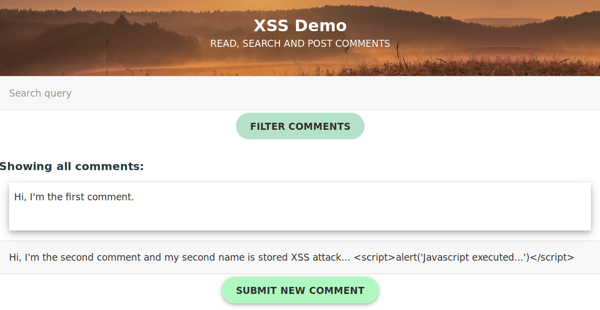

# xss-demo
Minimal, flask-powered python web app to demonstrate reflected and stored XSS attacks.
Less than 30 lines of Python + 40 lines HTML template.



# Quickstart

* Clone this repository.
* Create a [virtual environment](https://virtualenvwrapper.readthedocs.io/) (if you don't want to install `flask` in your global python environment) and 
  activate it.
* `pip install flask`
* `FLASK_ENV=development flask run`
* Open [127.0.0.1:5000](http://127.0.0.1:5000/) in your webbrowser.

As you started the flask app in development mode, any source changes should apply immediately so you can just refresh
the page. If you want to clear the database, just delete the `database.db` file that is (re-)created on first use.

# Making it vulnerable

To demonstrate XSS flaws you can change 
[`templates/index.html` line 2](https://github.com/bgres/xss-demo/blob/master/templates/index.html#L2)
```jinja2

```
And then try `<script>alert('javascript was executed')</script>` as inputs both for the search input (reflected XSS) and 
the write comment input (stored XSS).

To demonstrate that context-aware filtering is important, you can change 
[line 33 in `index.html`](https://github.com/bgres/xss-demo/blob/master/templates/index.html#L33) to
```html
      <div title={{ comment }}>
```

and even with line 2 having autoescape set to true, you can mount a stored XSS attack by adding a comment like this:
```html
tooltip onmouseover=alert(1)
```

# Protection mechanisms

Of course you should never deactivate autoescaping in jinja/flask, so you should never have 
`` in your production templates. This way you will always get the 
[standard HTML context filtering](https://flask.palletsprojects.com/en/1.1.x/templating/#controlling-autoescaping)
for variables in your templates.


The tooltip attack mentioned above can of course be avoided by using quotes correctly on 
[line 33 ](https://github.com/bgres/xss-demo/blob/master/templates/index.html#L33):
```html
      <div title="{{ comment }}">
```


You can also test using 
[Content Security Policy headers](https://developer.mozilla.org/en-US/docs/Web/HTTP/Headers/Content-Security-Policy) to 
disallow unsafe inline javascript by replacing 
[`app.py` line 16-18](https://github.com/bgres/xss-demo/blob/master/app.py#L16-L18) with:

```python
    from flask import make_response
    r = make_response(render_template('index.html',
                      comments=comments,
                      search_query=search_query))
    r.headers.set('Content-Security-Policy', "script-src 'none'")
    return r
```
